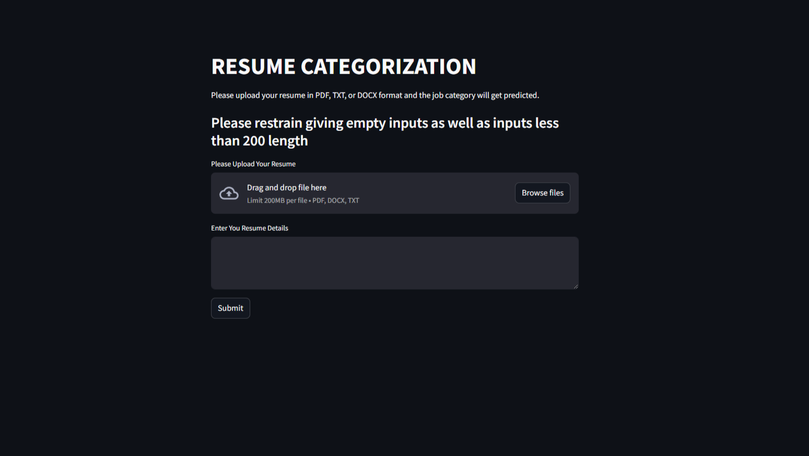
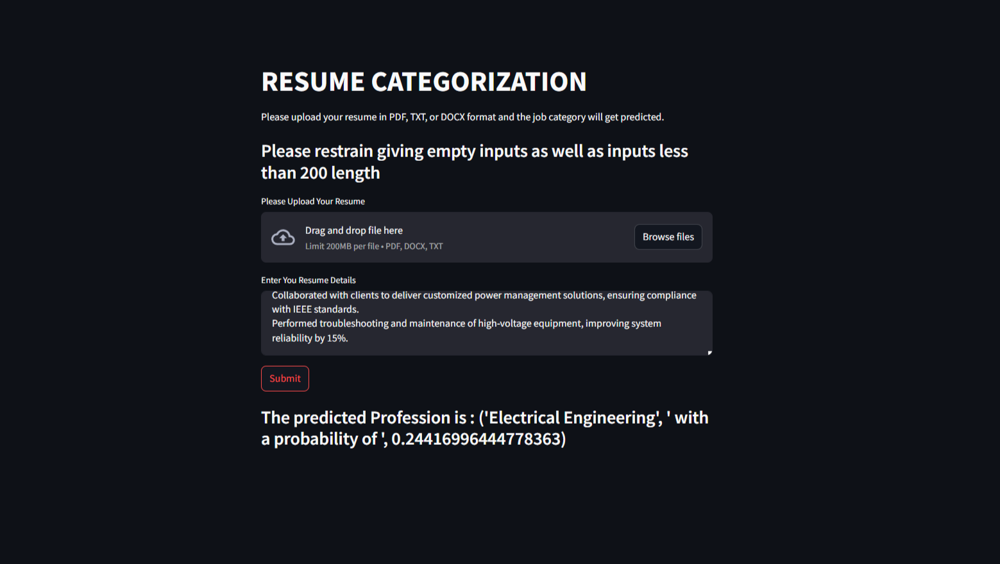
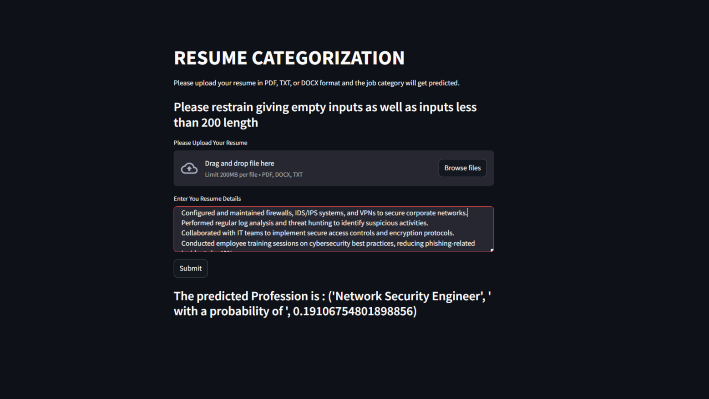
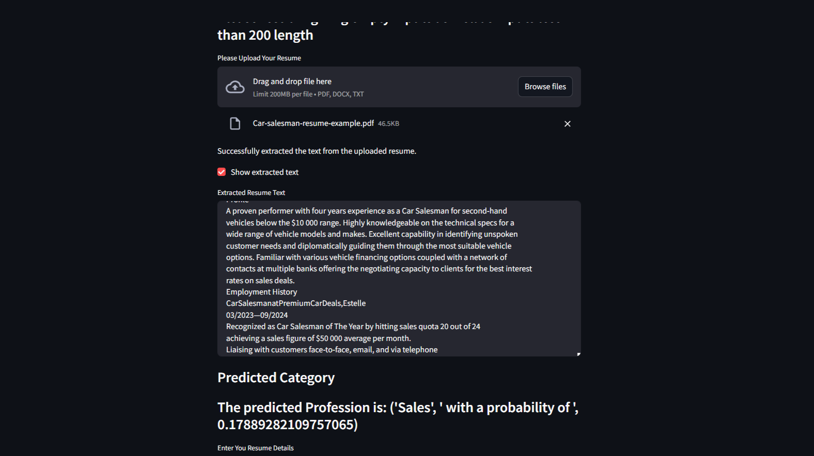

<h1> NLP Resume Classification </h1>

# Overview
This NLP Resume Classification project is designed to classify resumes into predefined categories using Natural Language Processing (NLP) techniques. The goal of this project is to automate the process of resume categorization, making it easier for recruiters and HR teams to filter candidates based on their skills, experience, and qualifications.

This project leverages advanced NLP concepts such as data cleaning , feature engineering , TF-IDF vectorization , and SMOTE to handle data imbalance. A Logistic Regression model was trained using cross-validation , achieving an accuracy score of 0.9948186528497409 on the test set. Evaluation metrics such as confusion matrix and classification report were used to assess the model's performance.

During development, challenges such as overfitting , handling garbage values , and ensuring robustness against out-of-dataset inputs were addressed effectively. Specific conditions were implemented to ensure the model receives valid input, such as rejecting empty values and requiring a minimum resume length of 200 characters. Additionally, a Streamlit web application was developed to provide a user-friendly interface for uploading resumes and viewing classification results.

# Features

1. **Data Cleaning**: 
   - Removed unnecessary noise from the text data, including special characters, stopwords, and punctuation.
   - Normalized text by converting it to lowercase and applying stemming/lemmatization.

2. **Feature Engineering**: 
   - Extracted meaningful features from the cleaned text data to improve model performance.

3. **TF-IDF Vectorization**: 
   - Transformed textual data into numerical vectors using Term Frequency-Inverse Document Frequency (TF-IDF) for efficient processing by the machine learning model.

4. **Handling Data Imbalance**: 
   - Applied Synthetic Minority Oversampling Technique (SMOTE) after TF-IDF vectorization to address class imbalance in the dataset.

5. **Handling Data Imbalance**: 
   - Applied Synthetic Minority Oversampling Technique (SMOTE) after TF-IDF vectorization to address class imbalance in the dataset.

6. **Model Development**:
   - Utilized Logistic Regression as the classification model.
   - Implemented cross-validation using `cross_val_score` for model evaluation.

7. **Thresholding for Robustness**: 
   - Experimented with various threshold values to handle garbage inputs and out-of-dataset values, ensuring the model does not produce incorrect predictions for invalid inputs.

8. **Input Validation**: 
   - Implemented conditions to reject empty inputs and enforce a minimum resume length of 200 characters, reducing the risk of garbage values affecting predictions.

9. **Streamlit Web Interface**: 
   - Developed a Streamlit application to allow users to upload resumes and view classification results in real-time.

# Installation and Setup

1. Python
2. Pandas
3. NumPy
4. NLTK
5. scikit-learn
6. Streamlit

# Challenges and Solutions

1. **Garbage Values**: 
- Issue: The model produced incorrect predictions for garbage inputs or out-of-dataset values.
- Solution: Experimented with threshold values and implemented input validation to reject invalid inputs.

2. **Data Imbalance**: 
- Issue: Certain classes/features in the dataset were underrepresented, leading to biased.
- Solution: Used SMOTE to oversample minority classes and balance the dataset.

# Streamlit Web Interface
The Streamlit web application provides a user-friendly interface for interacting with the model. Users can:
* Upload a resume file `(.txt, .pdf, or .docx)`.
* View the predicted category of the resume.

#### To run the Streamlit app:
* streamlit run app.py

# Streamlit WebPage Image 

## HomePage :

## Classification Results :
#### Returning predicted resume category based on user's input 

## Classification Results :
#### Returning predicted resume category based on user's input 

## Classification Result For Uploaded PDF :
#### Returning predicted resume category based on uploaded PDF 

# Future Enhancements
- Advanced Models :
Experiment with more advanced models and Learning architectures like LSTM, BERT leveraging Deep Learning.
- Improved Preprocessing :
Incorporate domain-specific stopword removal and custom tokenization rules.
- Deployment :
Deploy the Streamlit app on a cloud platform like Heroku , AWS , or Streamlit Cloud for public access.

# Contributions
Please Feel free to contribute to this project by submitting issues or pull requests.

Any enhancements, bug fixes, or optimizations are extremely welcomed!

